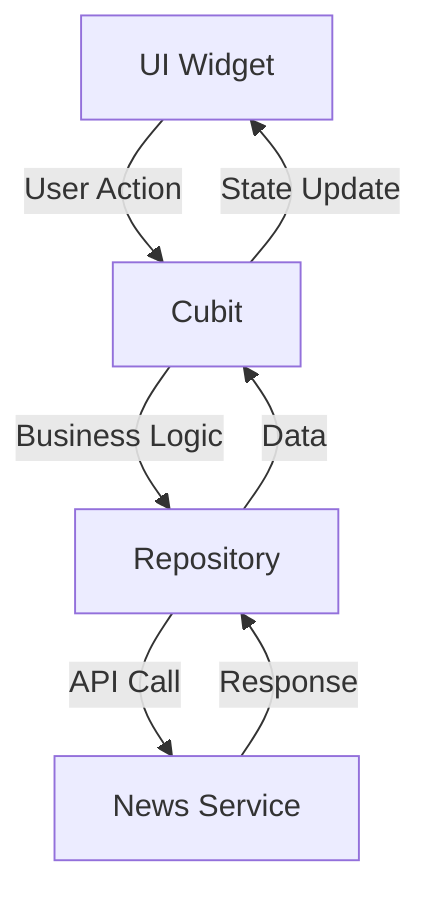

# 📰 Arabic News App

> A modern, feature-rich Flutter news application delivering the latest Arabic news with an elegant user experience.

[](https://flutter.dev/)
[](https://dart.dev/)
[](LICENSE)
[]()

---

## 📋 Table of Contents

1. [Overview](#-overview)
2. [Demo & Screenshots](#-demo--screenshots)
3. [Features](#-features)
4. [Installation](#-installation)
5. [Usage](#-usage)
6. [Architecture](#-architecture)
7. [Technology Stack](#-technology-stack)
9. [API Integration](#-api-integration)
10. [Development Environment](#-development-environment)

---

## 📖 Overview

**Arabic News App** is a comprehensive Flutter-based mobile application designed specifically for Arabic-speaking users who want to stay updated with the latest news. The app provides a seamless news reading experience with modern UI/UX design, featuring breaking news, categorized articles, bookmark functionality, and customizable themes.

### 🎯 Purpose

- **Problem Solved**: Provides easy access to Arabic news content in a mobile-optimized format
- **Target Audience**: Arabic-speaking news readers, mobile users seeking local and international news
- **Project Context**: Personal/Educational project demonstrating modern Flutter development practices

### ✨ Key Benefits

- **Clean Architecture**: Maintainable and scalable codebase using BLoC pattern
- **Responsive Design**: Optimized for various screen sizes and orientations
- **Offline Support**: Bookmark articles for offline reading
- **Accessibility**: Designed with Arabic RTL support and custom fonts
- **Performance**: Efficient state management and optimized API calls

---

## 🖼️ Demo & Screenshotsa

### 📱 App Screens Preview

> **Note**: Screenshots will be added here showing the main features of the app including home screen, news details, bookmarks, and theme switching.

#### Key Functionality

- **Splash Screen**: Animated loading screen with Lottie animations
- **Home Feed**: Curated news articles with breaking news carousel
- **News Details**: Full article view with rich content
- **Bookmarks**: Save and manage favorite articles
- **Profile/Settings**: Theme switching and user preferences

---

## 🚀 Features

### ✅ Current Features

#### 📰 Core News Features

- **Breaking News Carousel**: Highlighting important news stories
- **Category-based News**: Organized news by different categories
- **Article Details**: Full article view with images, content, and metadata
- **Search & Filter**: Easy navigation through news content
- **Real-time Updates**: Fresh news content from reliable API sources

#### 🔖 User Experience Features

- **Bookmark System**: Save articles for later reading
- **Dark/Light Theme**: Toggle between themes for comfortable reading
- **Arabic Language Support**: Full RTL layout and Arabic fonts
- **Smooth Navigation**: Intuitive bottom navigation with smooth transitions
- **Loading States**: User-friendly loading indicators and error handling

#### 🎨 UI/UX Features

- **Custom Fonts**: IBM Plex Sans Arabic for optimal Arabic text rendering
- **Responsive Design**: Adaptive layout for different screen sizes
- **Smooth Animations**: Lottie animations and page transitions
- **Material Design**: Following Material Design guidelines with custom enhancements

### 🔮 Planned Features (Roadmap)

- **Push Notifications**: Real-time news alerts
- **Social Sharing**: Share articles on social media platforms
- **User Accounts**: Personalized news preferences
- **Offline Reading**: Download articles for offline access
- **Comment System**: User engagement and discussions
- **Multi-language Support**: Support for additional languages

---

## 📦 Installation

### 📋 Prerequisites

Before you begin, ensure you have the following installed:

- **Flutter SDK**: Version 3.5.3 or higher
- **Dart SDK**: Version 3.5.3 or higher
- **Android Studio**: For Android development
- **Xcode**: For iOS development (macOS only)
- **VS Code**: Recommended IDE with Flutter extension

### 🛠️ System Requirements

| Platform | Minimum Version            |
| -------- | -------------------------- |
| Android  | API Level 21 (Android 5.0) |
| iOS      | iOS 12.0+                  |
| Windows  | Windows 10+                |
| macOS    | macOS 10.14+               |
| Linux    | 64-bit Linux distribution  |

### 📥 Installation Steps

1. **Clone the Repository**

   ```bash
   git clone https://github.com/yourusername/news_app.git
   cd news_app
   ```

2. **Install Dependencies**

   ```bash
   flutter pub get
   ```

3. **Verify Flutter Installation**

   ```bash
   flutter doctor
   ```

4. **Run the Application**

   ```bash
   # For Android
   flutter run

   # For iOS (macOS only)
   flutter run -d ios

   # For Web
   flutter run -d chrome

   # For Windows
   flutter run -d windows
   ```

### 🐳 Docker Setup (Optional)

```dockerfile
# Dockerfile for development environment
FROM cirrusci/flutter:3.5.3

WORKDIR /app
COPY . .
RUN flutter pub get
EXPOSE 8080
CMD ["flutter", "run", "--web-port=8080", "--web-hostname=0.0.0.0"]
```

---

## 💻 Usage

### 🚀 Quick Start

1. **Launch the App**: Open the application on your device
2. **Splash Screen**: Wait for the loading animation to complete
3. **Home Screen**: Browse the latest news and breaking news carousel
4. **Navigation**: Use the bottom navigation to switch between sections:
   - 🏠 **Home**: Latest news and breaking news
   - 🔖 **Bookmarks**: Saved articles
   - 👤 **Profile**: Settings and theme preferences

### 📖 Detailed Usage

#### Reading News

```dart
// Example of how news is loaded
void loadNews() {
  context.read<NewsCubit>().getNews();
  context.read<BreakingNewsCubit>().getBreakingNews();
}
```

#### Bookmarking Articles

- Tap the bookmark icon on any article
- View saved articles in the Bookmarks section
- Remove bookmarks by tapping the icon again

#### Theme Switching

```dart
// Toggle between light and dark themes
context.read<ThemeCubit>().toggleTheme();
```

### ⚙️ Configuration Options

#### API Configuration

The app uses NewsData.io API. To configure:

1. **Get API Key**: Register at [NewsData.io](https://newsdata.io/)
2. **Update API Key**: Replace the API key in `lib/data/Api/api.dart`

```dart
// lib/data/Api/api.dart
final String apiKey = "your_api_key_here";
```

#### Theme Customization

Modify themes in `lib/main.dart`:

```dart
// Custom theme configuration
ThemeData customTheme = ThemeData(
  fontFamily: 'IBMPlexSansArabic',
  // Add your customizations
);
```

---

## 🏗️ Architecture

### 📐 Clean Architecture Overview

The app follows **Clean Architecture** principles with clear separation of concerns:

```
lib/
├── 📁 data/           # Data Layer
│   ├── Api/           # API services
│   ├── Models/        # Data models
│   └── Repository/    # Data repositories
├── 📁 logic/          # Business Logic Layer
│   └── cubit/         # State management (BLoC/Cubit)
└── 📁 Presentation/   # Presentation Layer
    ├── screens/       # UI screens
    └── widgets/       # Reusable widgets
```

### 🔄 State Management Flow

The app uses **BLoC/Cubit** pattern for state management:



### 📦 Key Components

#### 🔧 Cubits (State Management)

- **NewsCubit**: Manages general news state
- **BreakingNewsCubit**: Handles breaking news
- **BookmarkCubit**: Manages bookmark functionality
- **ThemeCubit**: Controls app theme

#### 🌐 Data Layer

- **NewsServices**: API integration with NewsData.io
- **NewsModel**: Data model for news articles
- **BookmarkModel**: Data model for bookmarked articles

#### 🎨 Presentation Layer

- **Screens**: Full-page views (Home, Details, Bookmarks, Profile)
- **Widgets**: Reusable UI components

---

## 🛠️ Technology Stack

### 💙 Frontend Framework

- **Flutter**: 3.5.3 - Cross-platform mobile development
- **Dart**: 3.5.3 - Programming language

### 📱 Mobile Development

- **Material Design**: UI components and design system
- **Cupertino Icons**: iOS-style icons
- **Custom Fonts**: IBM Plex Sans Arabic for optimal Arabic rendering

### 🔄 State Management

- **flutter_bloc**: 8.1.6 - BLoC pattern implementation
- **bloc**: 8.1.4 - Core BLoC library

### 🌐 Networking & APIs

- **dio**: 5.7.0 - HTTP client for API calls
- **NewsData.io API**: Real-time news data source

### 🎨 UI/UX Libraries

- **carousel_slider**: 5.0.0 - Breaking news carousel
- **google_nav_bar**: 5.0.6 - Bottom navigation
- **lottie**: 3.1.2 - Animations
- **smooth_page_indicator**: 1.2.0+3 - Page indicators
- **animated_splash_screen**: 1.3.0 - Splash screen animations

### 💾 Data Persistence

- **shared_preferences**: 2.3.2 - Local data storage

### 🧪 Development Tools

- **flutter_lints**: 4.0.0 - Code linting
- **flutter_test**: Testing framework

---


## 🔌 API Integration

### 🌐 NewsData.io API

The app integrates with [NewsData.io](https://newsdata.io/) for real-time news data.

#### 📊 API Endpoints Used

```dart
// General News
GET: "https://newsdata.io/api/1/latest?apikey={API_KEY}&country=eg&language=ar"

// Breaking News
GET: "https://newsdata.io/api/1/latest?apikey={API_KEY}&language=ar"
```

#### 🔑 API Configuration

```dart
class NewsServices {
  final Dio dio = Dio();

  Future<List<NewsModel>> getAllNews() async {
    // API implementation
  }

  Future<List<NewsModel>> getBreakingNews() async {
    // Breaking news implementation
  }
}
```

#### 📋 API Response Format

```json
{
  "status": "success",
  "totalResults": 100,
  "results": [
    {
      "title": "News Title",
      "description": "News Description",
      "content": "Full Content",
      "pubDate": "2024-01-01 12:00:00",
      "image_url": "https://example.com/image.jpg",
      "creator": ["Author Name"],
      "category": ["general"]
    }
  ]
}
```

#### ⚠️ Rate Limits & Best Practices

- **Free Tier**: 200 requests per day
- **Caching**: Implement local caching for better performance
- **Error Handling**: Graceful handling of API failures
- **Retry Logic**: Automatic retry for failed requests

---

## 🖥️ Development Environment

### 🛠️ Recommended IDE Setup

#### VS Code Extensions

```json
{
  "recommendations": [
    "dart-code.flutter",
    "dart-code.dart-code",
    "ms-vscode.vscode-json",
    "bradlc.vscode-tailwindcss"
  ]
}
```

#### Android Studio Plugins

- Flutter Plugin
- Dart Plugin
- ADB Idea
- Rainbow Brackets

### 🔧 Build Configuration

#### Debug Build

```bash
flutter run --debug
```

#### Release Build

```bash
# Android APK
flutter build apk --release

# Android App Bundle
flutter build appbundle --release

# iOS (macOS only)
flutter build ios --release

# Web
flutter build web --release
```

#### Build Environment Variables

```bash
# Set API key for production builds
export NEWS_API_KEY="your_production_api_key"
```

### 📊 Performance Monitoring

#### Flutter Inspector

- Use Flutter Inspector for widget debugging
- Monitor widget rebuild performance
- Analyze memory usage

#### Profiling Commands

```bash
# Profile app performance
flutter run --profile

# Generate performance trace
flutter run --trace-startup
```

---

---


---

## 📊 Project Statistics


---

_This README was crafted with attention to detail to provide comprehensive information about the Arabic News App. For any questions or suggestions about this documentation, please open an issue._
